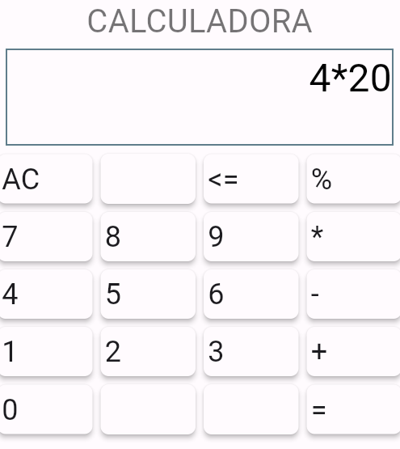

<h1>Basic Calculator in Flutter</h1>

  

This is a simple calculator app built using Flutter, allowing users to perform basic arithmetic operations such as addition, subtraction, multiplication, and percentage calculations.

<h2>Features</h2>
<ul>
    <li>Addition</li>
    <li>Subtraction</li>
    <li>Multiplication</li>
    <li>Percentage calculation</li>
</ul>

<h2>Contributing</h2>

Contributions are welcome! Here's how you can contribute to this project:

<ol>
    <li>Fork the repository.</li>
    <li>Create your feature branch: <code>git checkout -b feature/new-feature</code>.</li>
    <li>Commit your changes: <code>git commit -am 'Add some feature'</code>.</li>
    <li>Push to the branch: <code>git push origin feature/new-feature</code>.</li>
    <li>Submit a pull request.</li>
</ol>

<h2>License</h2>

This project is licensed under the MIT License - see the <a href="LICENSE">LICENSE</a> file for details.

Happy calculating! 🧮✨

